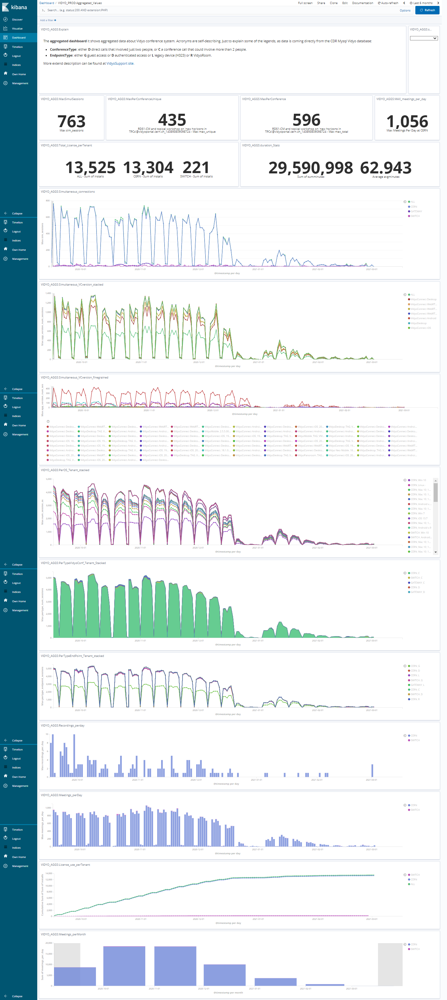

# aggsvidyo
Long term stats for Vidyo video conference platform. It contains just annonymous data.

Online data collection is managed by [avstats](https://github.com/CERNCDAIC/resthttpck) Kubernetes cluster. Aggsvidyo just extracts aggregated statistics.

## Kubernetes cluster for aggregated data from Vidyo

A logstash container will collect statistics at certain point in time, querying the Elastisearch backend. 

[CERN Kubernetes infrastructure](https://clouddocs.web.cern.ch/containers/README.html) (authentication required) has been used. 

```
--create image
docker build -f Dockerfile .
docker build -t gitlab-registry.cern.ch/collaborativeapps/aggsvidyo .
docker push gitlab-registry.cern.ch/collaborativeapps/aggsvidyo

--setup environment
$ eval $(ai-rc "IT project")
$ . ./env_zoom-av.sh
--further setup omitted 
$ kubectl apply -f avidyoaggs.yml
```

This leads to some dahsboards in Kibana e.g. how many people are connected simultaneously, meetings per month, meeting with maximum number of simultaneous attendees, use of codecs, etc.


